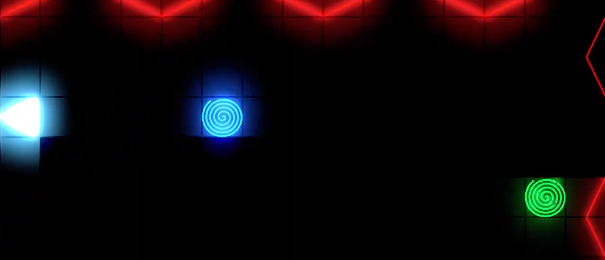
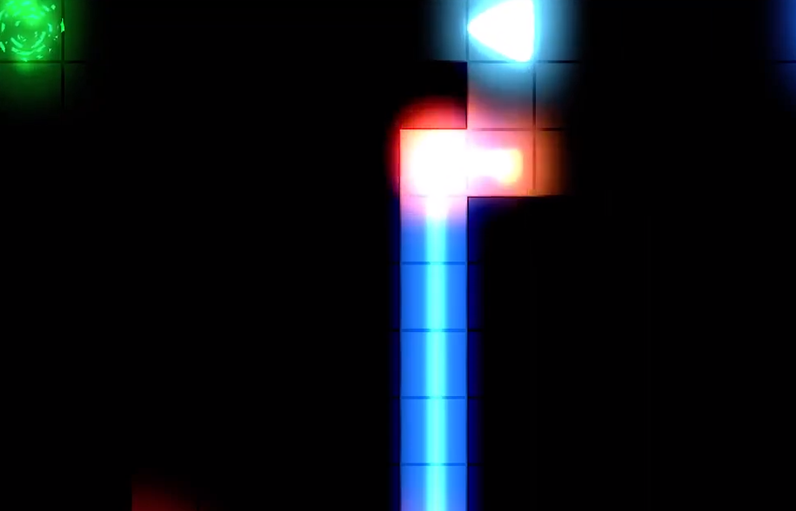

# Puzzle game

## Godot

This game was made in godot as part of a game jam, in the next link you can see how the game looks like.

The main idea is shoot a laser to a lasert to a object to continue in the next level, also the player can "materialize" and "unmaterialize" in order to pass the red lines, using some objects to deflect the laser and hit the objective.

[Video](https://www.youtube.com/watch?v=aIupag8W1so&ab_channel=IsaacManjarrezleyva)

## Images

